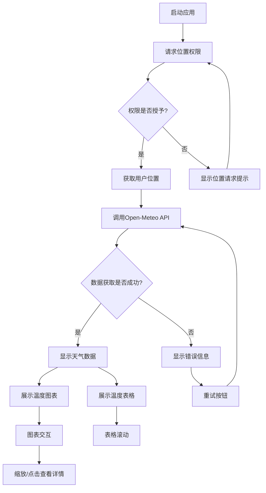

# 天气应用流程图

## 应用流程

## 流程说明

1. **应用启动**
   - 初始化应用
   - 检查网络连接状态

2. **位置权限处理**
   - 请求用户位置权限
   - 处理权限拒绝情况
   - 提供手动输入位置的备选方案

3. **数据获取**
   - 使用Open-Meteo API获取天气数据
   - 实现错误处理和重试机制
   - 显示加载状态

4. **数据展示**
   - 温度图表展示
     - 响应式布局
     - 交互功能（缩放、点击）
   - 温度表格展示
     - 可滚动列表
     - 时间-温度对应关系

5. **错误处理**
   - 网络错误提示
   - 数据加载失败处理
   - 重试机制

6. **性能优化**
   - 数据缓存
   - 后台数据同步
   - 平滑动画过渡 